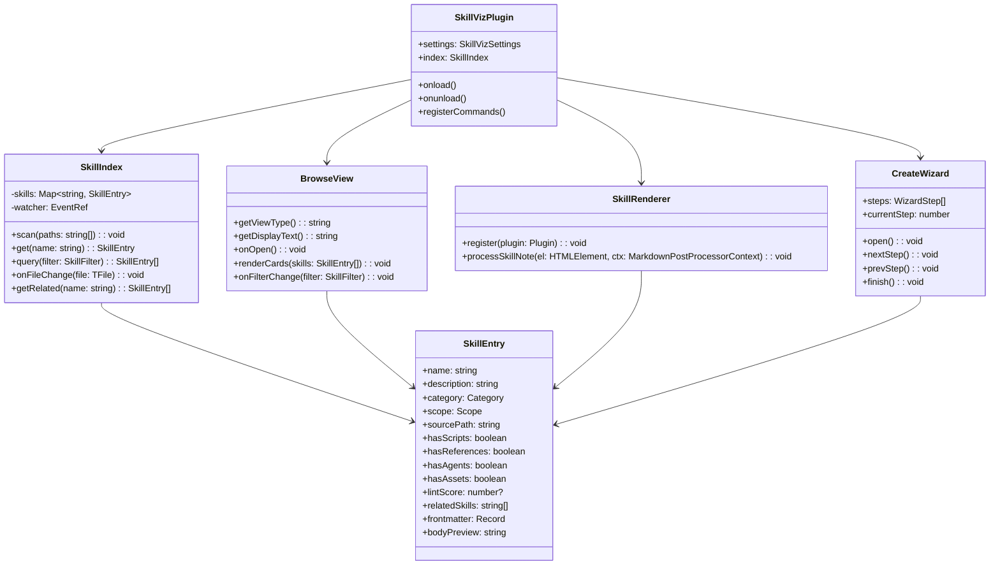
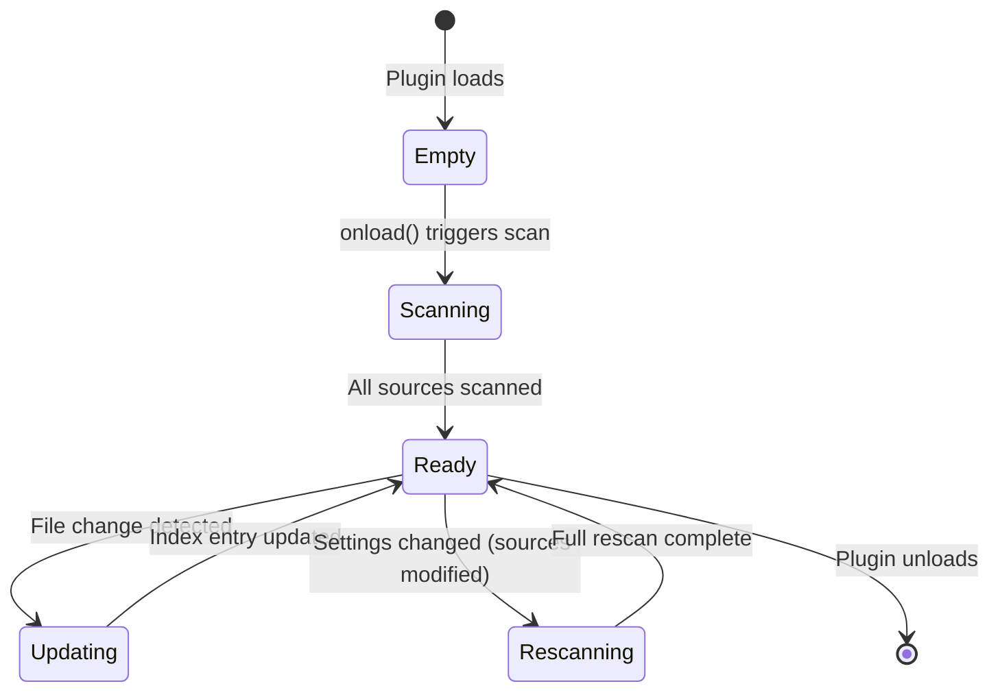

# skill-viz: Obsidian Plugin Design Specification

**Date:** 2026-03-26
**Status:** Draft v2
**Author:** Jason Zhang
**Repo:** github.com/patchmyday/skill-viz

---

## Table of Contents

1. [Problem Statement](#1-problem-statement)
2. [Audiences](#2-audiences)
3. [Architecture](#3-architecture)
4. [Feature Details](#4-feature-details)
   - [Browse Mode](#41-browse-mode-sidebar-panel)
   - [View Mode](#42-view-mode-rich-skillmd-renderer)
   - [Create Mode](#43-create-mode-guided-wizard)
   - [Vault Generator](#44-vault-generator-companion-python-script)
5. [Integration Points](#5-integration-points)
6. [Tech Stack](#6-tech-stack)
7. [Data Model](#7-data-model)
8. [UI/UX Details](#8-uiux-details)
9. [Phased Rollout](#9-phased-rollout)
10. [Out of Scope](#10-out-of-scope)
11. [Open Questions](#11-open-questions)

---

## 1. Problem Statement

Claude Code skills are the primary extension mechanism for 30+ AI coding agents. A skill is a directory containing a `SKILL.md` file (YAML frontmatter + markdown body) plus optional scripts, references, agents, and assets. The ecosystem has exploded — 36,000+ skills on SkillHub, 8,600+ on Skills Playground, 400+ official plugins — but **every tool that surfaces skills is a shallow registry**. No existing tool renders SKILL.md as a rich, living document.

### The Gaps

| Gap | Impact |
|-----|--------|
| **No visual browser** | Users `ls` directories or grep frontmatter to find skills |
| **No rich rendering** | SKILL.md is read as raw markdown; frontmatter is invisible YAML |
| **No creation workflow** | Users copy-paste from examples; the critical `description` field (which serves as both human UI text AND AI auto-invocation trigger) is written blind |
| **No relationship view** | Skills reference each other, share categories, and declare dependencies (`benefits-from`) — none of this is visualized |
| **No quality signal** | No way to see if a skill's description will trigger reliably or if its structure follows best practices |
| **No structured note view in Obsidian** | obsidian-projects was discontinued July 2025; there's an open gap for structured-data views in vaults |

### Why Obsidian

- Jason uses Obsidian daily — it's already in the workflow
- SKILL.md is markdown with YAML frontmatter — Obsidian's native format
- Graph view, Canvas, Dataview, and Templater provide infrastructure for free
- The plugin ecosystem allows deep integration without forking Obsidian
- Vaults can be shared via Quartz (static site) or git

### The Thesis

**skill-viz** turns Obsidian into an interactive workbench for Claude Code skills: browse installed and community skills visually, view any SKILL.md as a rich living document (not raw YAML), create new skills through a guided wizard, and export everything back to Claude Code's filesystem.

---

## 2. Audiences

### 2.1 Beginners

**Profile:** First-time skill creators, new to Claude Code's extension model.

**Needs:**
- Understand what a skill is and how it works (progressive disclosure)
- See concrete examples with annotations
- Create a first skill without reading the spec
- Avoid the #1 pitfall: vague or overly broad `description` fields

**How skill-viz serves them:**
- Guided creation wizard with fill-in-the-blank description scaffolding
- Template gallery with preview (e.g., "dev tool," "document processor," "workflow")
- Quality indicators that flag under-specified descriptions before export
- Inline guides: "What Is A Skill," "Skill Anatomy," "Writing Good Descriptions"

### 2.2 Daily Users

**Profile:** Developers who use Claude Code regularly and have 10-50+ skills installed.

**Needs:**
- Quickly find which skill handles a given task
- See at a glance what's installed, where, and whether it's up to date
- Modify a skill's description or body without hunting for filesystem paths
- Understand relationships: "if I use pdf, I might also want docx"

**How skill-viz serves them:**
- Browse Mode sidebar with instant search, category filters, and scope badges
- View Mode renders frontmatter as a styled header card, not raw YAML
- Action buttons: "Open in Claude Code," "Export," "Validate"
- Related skills panel driven by WikiLinks, shared categories, and `benefits-from`

### 2.3 Advanced / Community

**Profile:** Skill authors, maintainers of skill repos (gstack, alirezarezvani, jeffallan), power users who publish and share.

**Needs:**
- Audit skill quality across a large collection
- Visualize the dependency graph for a skill suite
- Batch-import community repos and compare with installed versions
- Share curated skill collections

**How skill-viz serves them:**
- skill-lint integration shows quality scores per skill
- Canvas map auto-generated from dependency/relationship data
- Vault Generator imports from any source (local dirs, git repos, gstack `.tmpl`)
- Dataview queries for arbitrary cross-cutting analysis
- Quartz export path for publishing skill catalogs as static sites

---

## 3. Architecture

### 3.1 System Overview

```
┌─────────────────────────────────────────────────────────────────┐
│                        Obsidian Vault                           │
│                                                                 │
│  ┌──────────────┐  ┌──────────────┐  ┌────────────────────┐    │
│  │  Browse Mode  │  │  View Mode   │  │   Create Mode      │    │
│  │  (Sidebar)    │  │  (Renderer)  │  │   (Wizard Modal)   │    │
│  │              │  │              │  │                    │    │
│  │  SkillIndex  │  │  Markdown    │  │  DescriptionBuilder│    │
│  │  CardList    │  │  PostProc    │  │  TemplateGallery   │    │
│  │  FilterBar   │  │  HeaderCard  │  │  StepWizard        │    │
│  └──────┬───────┘  └──────┬───────┘  └─────────┬──────────┘    │
│         │                 │                     │               │
│         └────────────┬────┴─────────────────────┘               │
│                      │                                          │
│              ┌───────▼────────┐                                 │
│              │   SkillIndex    │  In-memory index of all skills  │
│              │   (singleton)   │  Built on vault load, updated   │
│              │                 │  on file change events          │
│              └───────┬────────┘                                  │
│                      │                                          │
│         ┌────────────┼────────────┐                              │
│         ▼            ▼            ▼                              │
│   app.vault    app.metadata   skill-lint                        │
│   (file I/O)   Cache          (quality scores)                  │
│                (frontmatter)                                    │
└─────────────────────────────────────────────────────────────────┘

External:
┌──────────────────────┐     ┌──────────────────────┐
│  Vault Generator     │     │  Claude Code FS      │
│  (Python CLI)        │────▶│  ~/.claude/skills/   │
│  generate.py         │◀────│  .claude/skills/     │
│  Imports → vault     │     │  project skills      │
│  Exports → Claude    │     └──────────────────────┘
└──────────────────────┘
```

### 3.2 Plugin File Layout

```
skill-viz/
├── src/
│   ├── main.ts                    # Plugin entry point (onload/onunload)
│   ├── settings.ts                # Plugin settings tab
│   ├── types.ts                   # Shared type definitions
│   │
│   ├── index/
│   │   ├── SkillIndex.ts          # Core index: scan, parse, cache, query
│   │   ├── SkillParser.ts         # SKILL.md frontmatter + body parser
│   │   └── CategoryMapper.ts      # Map skills to 12 canonical categories
│   │
│   ├── browse/
│   │   ├── BrowseView.ts          # ItemView subclass for sidebar panel
│   │   ├── SkillCard.ts           # Individual skill card component
│   │   ├── FilterBar.ts           # Search + category filter controls
│   │   └── ScopeBadge.ts          # User/project/local scope indicator
│   │
│   ├── view/
│   │   ├── SkillRenderer.ts       # registerMarkdownPostProcessor logic
│   │   ├── FrontmatterHeader.ts   # Visual metadata panel above body
│   │   ├── DescriptionCard.ts     # Dual-audience description display
│   │   ├── StructureTree.ts       # File tree of skill directory contents
│   │   └── RelatedSkills.ts       # Related skills panel with links
│   │
│   ├── create/
│   │   ├── CreateWizard.ts        # Modal-based step wizard
│   │   ├── DescriptionBuilder.ts  # Guided description writing
│   │   ├── TemplateGallery.ts     # Template selection with previews
│   │   └── SkillScaffolder.ts     # Generate skill directory structure
│   │
│   └── integrations/
│       ├── SkillLintBridge.ts     # Call skill-lint CLI, parse results
│       ├── ClaudianBridge.ts      # Send prompts to Claudian plugin
│       └── DataviewHelper.ts      # Register custom Dataview fields
│
├── styles/
│   └── styles.css                 # Plugin styles (auto-loaded by Obsidian)
│
├── generate/                      # Companion vault generator (Python)
│   ├── generate.py                # Main CLI script
│   ├── config.yaml                # Source directories to scan
│   ├── requirements.txt           # pyyaml, etc.
│   └── templates/
│       ├── dashboard.md           # Dashboard template
│       └── canvas.json            # Canvas layout template
│
├── manifest.json                  # Obsidian plugin manifest
├── package.json
├── tsconfig.json
├── esbuild.config.mjs
├── README.md
└── docs/
    └── design.md                  # This file
```

### 3.3 Key Classes



---

## 4. Feature Details

### 4.1 Browse Mode (Sidebar Panel)

**Implementation:** Custom `ItemView` registered as `skill-viz-browse`, opened in the right sidebar leaf.

#### 4.1.1 Source Scanning

The plugin scans configurable skill source directories on vault load and on settings change:

```typescript
interface SkillSource {
  path: string;          // Absolute path to scan
  label: string;         // Display name ("Installed", "Official Repo", etc.)
  scope: "user" | "project" | "local";
  enabled: boolean;
}

// Default sources (auto-detected)
const DEFAULT_SOURCES: SkillSource[] = [
  { path: "~/.claude/skills/",       label: "User Skills",    scope: "user",    enabled: true },
  { path: ".claude/skills/",         label: "Project Skills", scope: "project", enabled: true },
  // Additional sources configured via settings
];
```

**Scanning logic:**
1. Walk each source directory recursively
2. Find all `SKILL.md` files
3. Parse YAML frontmatter (name, description, allowed-tools, metadata)
4. Detect sibling directories: `scripts/`, `references/`, `agents/`, `assets/`, `evals/`
5. Build `SkillEntry` objects and insert into `SkillIndex`
6. Register `app.vault` file-change watcher for live updates

#### 4.1.2 Card Layout

Each skill renders as a compact card in the sidebar:

```
┌─────────────────────────────────┐
│ 📄 pdf                    [U]   │  ← name + scope badge
│ ┌─────────────────────────────┐ │
│ │ Document Processing         │ │  ← category pill
│ └─────────────────────────────┘ │
│ Use when the user wants to do   │  ← description (truncated)
│ anything with PDF files...      │
│                                 │
│ [S] [R]           ●●●○○  78/100│  ← component badges + lint score
└─────────────────────────────────┘
```

**Card elements:**
- **Name** — skill name in bold, clickable (opens View Mode)
- **Scope badge** — `[U]` user, `[P]` project, `[L]` local — color-coded
- **Category pill** — colored chip from the 12 canonical categories
- **Description** — first 2 lines, truncated with ellipsis
- **Component badges** — `[S]` scripts, `[R]` references, `[A]` agents, `[E]` evals — dimmed if absent
- **Lint score** — dot indicator (1-5 dots) + numeric score if skill-lint is available

#### 4.1.3 Filtering & Search

Top of the sidebar panel:

```
┌─────────────────────────────────┐
│ 🔍 [Search skills...         ]  │
│                                 │
│ Category: [All ▼]               │
│ Scope:    ○ All ● User ○ Proj   │
│ Has:      □ Scripts □ Refs      │
│ Sort:     [Name ▼]              │
└─────────────────────────────────┘
```

- **Search** — fuzzy match against name + description text
- **Category filter** — dropdown of 12 canonical categories + "All"
- **Scope filter** — radio buttons: All / User / Project / Local
- **Component filter** — checkboxes: has scripts, has references, has agents
- **Sort** — Name (A-Z), Category, Lint Score, Recently Modified

Filter state persists across sessions via `plugin.saveData()`.

#### 4.1.4 The 12 Canonical Categories

Mapped from Claude Code's plugin system + common community conventions:

| Category | Color | Example Skills |
|----------|-------|---------------|
| Document Processing | `#4A90D9` | pdf, docx, pptx |
| Development Tools | `#7B68EE` | webapp-testing, mcp-builder |
| Creative & Design | `#E85D75` | canvas-design, brand-guidelines, slack-gif-creator |
| API & Integration | `#F5A623` | claude-api, slack |
| Meta & Workflow | `#50C878` | skill-creator, doc-coauthoring |
| Data & Analytics | `#20B2AA` | token-usage, investing-coach |
| DevOps & CI/CD | `#CD853F` | frontend-design |
| Communication | `#9370DB` | memory |
| Code Quality | `#FF6347` | simplify |
| Infrastructure | `#708090` | schedule, loop |
| Education | `#FFD700` | cheatsheet, dashboard |
| Other | `#A0A0A0` | uncategorized |

Category assignment uses a priority chain:
1. Explicit `category` field in frontmatter (if present)
2. gstack `metadata.category` (if present)
3. Keyword-based heuristic on name + description
4. Fallback to "Other"

### 4.2 View Mode (Rich SKILL.md Renderer)

**Implementation:** `registerMarkdownPostProcessor` that activates on any `.md` file containing `name` and `description` in its YAML frontmatter (skill detection heuristic). Additionally, a `skill-info` code block processor for embedding skill cards inline.

#### 4.2.1 Frontmatter Header Card

Replaces the default raw YAML display with a styled metadata panel:

```
╔═══════════════════════════════════════════════════════════════╗
║  pdf                                              v1.2.0     ║
║  ─────────────────────────────────────────────────────────    ║
║  📂 Document Processing    🔒 User Scope    ⚡ Tier 2        ║
║                                                               ║
║  Components: [Scripts ✓] [References ✓] [Agents ✗] [Evals ✗] ║
║  Quality: ●●●●○ 82/100                                       ║
║  License: MIT            Compatibility: >=0.2.53              ║
║                                                               ║
║  Dependencies: docx, pptx (benefits-from)                     ║
╚═══════════════════════════════════════════════════════════════╝
```

**Fields rendered:**
- `name` — large heading, styled
- `version` — semver from gstack extension, if present
- `category` — colored pill
- `scope` — where the skill is installed
- `preamble-tier` — gstack tier (1-4) indicating load priority
- Component presence indicators
- `lintScore` — from skill-lint bridge
- `license`, `compatibility` — if present
- `benefits-from` — rendered as clickable links to related skills
- `allowed-tools` — pill list if specified

**Frontmatter fields NOT rendered** (internal-only): `metadata.hash`, internal IDs.

#### 4.2.2 Description Card

The `description` field gets special treatment because it serves dual audiences:

```
┌─ Description ────────────────────────────────────────────────┐
│                                                              │
│  FOR HUMANS                                                  │
│  Use this skill whenever the user wants to do anything with  │
│  PDF files. This includes reading, merging, splitting,       │
│  rotating, watermarking, and creating PDFs.                  │
│                                                              │
│  ─────────────────────────────────────────────────────────    │
│                                                              │
│  AI TRIGGER ANALYSIS                                         │
│  Trigger phrases: "PDF", ".pdf", "merge PDF", "split PDF"   │
│  Negative triggers: "DO NOT TRIGGER when..."                 │
│  Token count: 87 tokens (~metadata budget)                   │
│  Specificity: ●●●●○ High                                    │
│                                                              │
└──────────────────────────────────────────────────────────────┘
```

**AI Trigger Analysis** extracts:
- Explicit trigger phrases (words after "TRIGGER when:", "Use when")
- Negative triggers (words after "DO NOT TRIGGER", "Not for")
- Description token count (approximated: `description.length / 4`)
- Specificity heuristic: ratio of concrete nouns/verbs to generic words

This analysis is computed locally — no API calls.

#### 4.2.3 Body Rendering

The SKILL.md body (below frontmatter) renders as standard Obsidian markdown with these enhancements:

- **Collapsible sections** — `## Heading` sections default to expanded but can be collapsed (CSS + JS toggle)
- **Code blocks** — syntax highlighted per language tag
- **WikiLinks** — skill references like `[[pdf]]` link to other skill notes in the vault
- **Callout blocks** — Obsidian callouts (`> [!info]`) render natively
- **Token budget indicator** — a subtle bar at the bottom showing body length vs. the 500-line recommended maximum

#### 4.2.4 Structure Tree

A collapsible panel showing the skill directory contents:

```
▾ pdf/
  ├── SKILL.md          ← you are here
  ├── scripts/
  │   ├── forms.py      (2.1 KB)
  │   └── merge.py      (1.8 KB)
  ├── references/
  │   └── reference.md  (4.2 KB)
  └── assets/
      └── logo.png      (12 KB)
```

- File sizes displayed
- Clickable to open in default editor (via `app.workspace.openLinkText`)
- Total size calculation for the skill directory

#### 4.2.5 Related Skills Panel

Bottom of the rendered view:

```
─── Related Skills ────────────────────────────────────────────
  [[docx]]  [[pptx]]  [[xlsx]]        ← same category
  [[skill-creator]]                    ← references this skill
  Benefits from: [[ocr-engine]]       ← gstack dependency
```

**Relationship sources (priority order):**
1. Explicit `benefits-from` field (gstack)
2. WikiLinks in the skill body
3. Same category (up to 5)
4. Shared `allowed-tools` entries

#### 4.2.6 Action Buttons

Rendered as a floating action bar at the top-right of the view:

| Button | Action |
|--------|--------|
| **Edit** | Open raw SKILL.md in editor pane |
| **Export** | Write skill back to Claude Code filesystem (calls export script) |
| **Validate** | Run skill-lint, show inline results |
| **Copy Path** | Copy the source SKILL.md path to clipboard |
| **Open Terminal** | Open terminal at skill directory (if terminal plugin installed) |

### 4.3 Create Mode (Guided Wizard)

**Implementation:** `Modal` subclass with a multi-step form. Invoked via command palette (`skill-viz: Create New Skill`) or Browse Mode's "+" button.

#### 4.3.1 Step-by-Step Flow

```
Step 1          Step 2            Step 3          Step 4          Step 5
┌──────────┐   ┌──────────────┐  ┌────────────┐  ┌────────────┐  ┌──────────┐
│  Name &  │──▶│ Description  │─▶│  Category  │─▶│   Body     │─▶│  Review  │
│  Basics  │   │  Builder     │  │  & Scope   │  │  Template  │  │ & Create │
└──────────┘   └──────────────┘  └────────────┘  └────────────┘  └──────────┘
```

**Step 1: Name & Basics**
- Skill name input with live validation:
  - Must be kebab-case
  - Must be < 64 characters
  - Must not conflict with existing skills (checked against SkillIndex)
- Optional: version (semver), license (dropdown), compatibility

**Step 2: Description Builder**

This is the critical step. The description field determines when Claude auto-invokes the skill. The wizard scaffolds it:

```
┌─ Description Builder ────────────────────────────────────────┐
│                                                              │
│  "When should Claude automatically start this skill?"        │
│                                                              │
│  Use when the user [asks about / wants to / is working on]:  │
│  ┌──────────────────────────────────────────────────────┐    │
│  │ create, read, edit, or manipulate Word documents     │    │
│  └──────────────────────────────────────────────────────┘    │
│                                                              │
│  TRIGGER when (specific signals — file types, imports, etc): │
│  ┌──────────────────────────────────────────────────────┐    │
│  │ mentions 'Word doc', '.docx', or requests documents  │    │
│  │ with formatting like tables of contents              │    │
│  └──────────────────────────────────────────────────────┘    │
│                                                              │
│  DO NOT TRIGGER when (prevent false positives):              │
│  ┌──────────────────────────────────────────────────────┐    │
│  │ user asks about PDFs, spreadsheets, or Google Docs   │    │
│  └──────────────────────────────────────────────────────┘    │
│                                                              │
│  ─── Preview ─────────────────────────────────────────────   │
│  "Use this skill when the user wants to create, read, edit,  │
│   or manipulate Word documents (.docx files). Trigger when   │
│   user mentions 'Word doc', '.docx', or requests documents   │
│   with formatting like tables of contents. Do NOT trigger    │
│   when user asks about PDFs, spreadsheets, or Google Docs."  │
│                                                              │
│  Token count: 62     Specificity: ●●●●○                     │
│  ┌──────────┐                                                │
│  │ 🤖 Ask Claudian to improve this description │             │
│  └──────────┘                                                │
└──────────────────────────────────────────────────────────────┘
```

**Quality heuristics (real-time feedback):**
- Warn if < 15 words ("Too vague — Claude won't know when to trigger this")
- Warn if > 256 words ("Too long — Claude loads this into every conversation")
- Warn if no concrete nouns/file-types/imports mentioned ("Add specifics")
- Warn if no DO NOT TRIGGER clause ("Consider adding exclusions to prevent false positives")
- Show token count approximation (must stay under ~100 tokens for metadata budget)

**Step 3: Category & Scope**
- Category selection from the 12 canonical categories (visual grid with icons)
- Install scope: User (global), Project (repo-specific), Local (vault only)
- Optional: preamble-tier (1-4) for gstack users
- Optional: allowed-tools list

**Step 4: Body Template**

Select a starter template from the Template Gallery (see 4.3.3), or start blank.

The body editor is a full markdown editor pane (Obsidian's native editor) with:
- Pre-populated section headers from the chosen template
- Inline hints as HTML comments (`<!-- Explain what the skill does in detail -->`)
- Live character/line count vs. 500-line budget

**Step 5: Review & Create**

Full preview of the generated SKILL.md with:
- Rendered frontmatter header (View Mode style)
- Rendered body
- File path where the skill will be created
- Buttons: "Create Skill" / "Back" / "Cancel"

On "Create Skill":
1. Create skill directory at target path
2. Write `SKILL.md` with frontmatter + body
3. Optionally create empty `scripts/`, `references/` subdirectories
4. If vault skill note doesn't exist, create one
5. Open the new skill note in Obsidian
6. Update SkillIndex

#### 4.3.2 Description Scaffolding Patterns

Pre-built description patterns the user can select as starting points:

| Pattern | Template |
|---------|----------|
| **File Type Handler** | "Use when the user wants to {action} {file-type} files (.{ext}). Trigger when user mentions '{keyword}' or references .{ext} files. Do NOT trigger for {exclusions}." |
| **API/SDK Integration** | "Use when code imports `{package}` or user asks to use {service}. Trigger when: {signals}. Do NOT trigger when: {exclusions}." |
| **Workflow/Process** | "Guide users through {process}. Use when user wants to {action}. Trigger when user mentions {keywords}." |
| **Code Quality** | "Use when {reviewing/testing/linting} code for {aspect}. Trigger when: {signals}. Do NOT trigger for {exclusions}." |
| **Creative** | "Create {output-type} using {approach}. Use when user asks to {action}. Trigger when: {signals}." |
| **Freeform** | Empty — user writes from scratch |

#### 4.3.3 Template Gallery

A visual gallery of complete skill templates with live previews:

```
┌─ Template Gallery ───────────────────────────────────────────┐
│                                                              │
│  ┌──────────┐  ┌──────────┐  ┌──────────┐  ┌──────────┐    │
│  │ 📄       │  │ 🔧       │  │ 🎨       │  │ 📦       │    │
│  │ Document │  │ Dev Tool │  │ Creative │  │ API      │    │
│  │ Handler  │  │          │  │          │  │ Wrapper  │    │
│  │          │  │          │  │          │  │          │    │
│  │ Process  │  │ Build,   │  │ Generate │  │ Wrap an  │    │
│  │ files of │  │ test, or │  │ visual   │  │ external │    │
│  │ a type   │  │ debug    │  │ content  │  │ API      │    │
│  └──────────┘  └──────────┘  └──────────┘  └──────────┘    │
│                                                              │
│  ┌──────────┐  ┌──────────┐  ┌──────────┐  ┌──────────┐    │
│  │ 🔄       │  │ 🧪       │  │ ⚙️       │  │ 📝       │    │
│  │ Workflow │  │ Testing  │  │ Config   │  │ Blank    │    │
│  │          │  │ Harness  │  │ Manager  │  │          │    │
│  └──────────┘  └──────────┘  └──────────┘  └──────────┘    │
│                                                              │
│  ─── Preview ─────────────────────────────────────────────   │
│  [Live rendered preview of selected template appears here]   │
│                                                              │
└──────────────────────────────────────────────────────────────┘
```

Each template includes:
- Pre-filled frontmatter with sensible defaults
- Section structure for the body (## Instructions, ## Examples, etc.)
- Example description following best practices
- Inline hints as HTML comments

#### 4.3.4 Claudian Integration

If the [Claudian](https://github.com/your/claudian) plugin is installed, the wizard offers AI-assisted features:

- **"Improve Description"** — sends the current description to Claude via Claudian with the prompt: "Improve this Claude Code skill description for better auto-invocation triggering. Keep it under 100 tokens. Preserve the intent but add specificity."
- **"Generate Body"** — given the name, description, and category, ask Claude to generate a starter skill body
- **"Suggest Related Skills"** — ask Claude to identify which existing skills (from SkillIndex) this new skill should reference or depend on

These features are optional — the wizard works fully without Claudian installed.

### 4.4 Vault Generator (Companion Python Script)

A standalone Python CLI that imports skills from the filesystem into an Obsidian vault. Useful for initial setup and bulk operations that are easier to script than to do through the plugin UI.

#### 4.4.1 CLI Interface

```bash
# Generate/update a vault from configured sources
python generate.py

# Generate with custom config
python generate.py --config my-config.yaml

# Import a single skill directory
python generate.py --import ~/my-skills/awesome-skill/

# Generate canvas map only
python generate.py --canvas-only

# Dry run (show what would be created/updated)
python generate.py --dry-run
```

#### 4.4.2 Configuration

```yaml
# config.yaml
sources:
  - path: ~/.claude/skills/
    label: "User Skills"
    scope: user
  - path: .claude/skills/
    label: "Project Skills"
    scope: project
  - path: ~/Documents/cyber/agents/skills/skills/
    label: "Official Skills Repo"
    scope: local

output: ~/skill-viz-vault/

options:
  generate_canvas: true
  generate_dashboard: true
  generate_guides: true
  link_detection: true        # Parse bodies for cross-skill references
  category_assignment: true   # Auto-assign categories
  overwrite_existing: false   # Only update if source is newer
```

#### 4.4.3 Generated Vault Structure

```
skill-viz-vault/
├── .obsidian/
│   ├── app.json                    # Editor: show frontmatter, enable WikiLinks
│   ├── graph.json                  # Graph color groups by category
│   ├── community-plugins.json      # ["dataview", "templater-obsidian", "buttons"]
│   └── plugins/
│       ├── dataview/data.json      # Dataview settings (inline queries enabled)
│       ├── templater-obsidian/data.json
│       └── buttons/data.json
│
├── skills/                         # One note per skill
│   ├── pdf.md
│   ├── docx.md
│   ├── webapp-testing.md
│   └── ...
│
├── _Dashboard.md                   # Main entry point
├── _Skill Map.canvas               # Visual Canvas layout
├── _templates/
│   └── New Skill.md                # Templater template
├── _guides/
│   ├── What Is A Skill.md
│   ├── Skill Anatomy.md
│   └── Writing Good Descriptions.md
└── _Export Guide.md
```

#### 4.4.4 Skill Note Format (Generated)

Each imported skill becomes an Obsidian note:

```markdown
---
name: pdf
description: "Use this skill whenever the user wants to do anything with PDF files..."
source: ~/.claude/skills/pdf/SKILL.md
scope: user
category: document-processing
tags:
  - skill
  - category/document-processing
has_scripts: true
has_references: true
has_agents: false
has_assets: false
has_evals: false
component_count: 2
last_synced: 2026-03-26T14:30:00Z
---

# pdf

> Use this skill whenever the user wants to do anything with PDF files. This
> includes reading or extracting text/tables from PDFs, combining or merging
> multiple PDFs, splitting PDFs apart, rotating pages...

## Body

[Full SKILL.md body content rendered here]

## Structure

| File | Size |
|------|------|
| scripts/forms.py | 2.1 KB |
| scripts/merge.py | 1.8 KB |
| references/reference.md | 4.2 KB |

## Related Skills

[[docx]] | [[pptx]]
```

#### 4.4.5 Canvas Generation

The `_Skill Map.canvas` file follows the [JSON Canvas](https://jsoncanvas.org) spec:

```json
{
  "nodes": [
    {
      "id": "pdf",
      "type": "file",
      "file": "skills/pdf.md",
      "x": 0, "y": 0,
      "width": 250, "height": 120,
      "color": "1"
    }
  ],
  "edges": [
    {
      "id": "pdf-docx",
      "fromNode": "pdf",
      "toNode": "docx",
      "fromSide": "right",
      "toSide": "left",
      "label": "related"
    }
  ]
}
```

**Layout algorithm:**
1. Group skills by category
2. Arrange categories in a grid (3 columns)
3. Within each category group, arrange skills vertically with 20px gaps
4. Draw edges between related skills (from WikiLinks and `benefits-from`)
5. Color-code nodes by category (using Obsidian Canvas's 6 color presets)

#### 4.4.6 Dashboard Generation

The `_Dashboard.md` includes Dataview queries and Buttons:

```markdown
# Skill Dashboard

## Quick Actions

```button
name: Create New Skill
type: command
action: Templater: Insert _templates/New Skill.md
```

```button
name: Regenerate Vault
type: command
action: Shell: python ~/skill-viz/generate.py
```

## All Skills (${count})

```dataview
TABLE
  description AS "Trigger",
  scope AS "Scope",
  component_count AS "Components"
FROM "skills"
SORT name ASC
```

## By Category

```dataview
TABLE WITHOUT ID
  link(file.link, name) AS "Skill",
  description AS "Trigger"
FROM "skills"
WHERE category = "document-processing"
SORT name ASC
```

## Recently Synced

```dataview
TABLE last_synced AS "Last Synced"
FROM "skills"
SORT last_synced DESC
LIMIT 10
```

## Quality Overview

```dataview
TABLE WITHOUT ID
  link(file.link, name) AS "Skill",
  length(description) AS "Desc Length",
  component_count AS "Components"
FROM "skills"
WHERE length(description) < 50
SORT length(description) ASC
```
```

---

## 5. Integration Points

### 5.1 skill-lint (Quality Scoring)

**Repo:** github.com/patchmyday/skill-lint (separate tool)
**Interface:** CLI command that outputs JSON

```bash
skill-lint score /path/to/skill-dir/
# Output: { "score": 82, "max": 100, "checks": [...], "warnings": [...] }
```

**Integration in skill-viz:**
- `SkillLintBridge.ts` spawns the `skill-lint` CLI as a child process
- Results cached per skill (invalidated on file change)
- Score displayed in Browse Mode cards and View Mode header
- Warnings rendered inline in View Mode (as Obsidian callout blocks)
- Validate button in View Mode triggers a fresh lint run

**Fallback:** If skill-lint is not installed, quality indicators are hidden (not errored). The plugin detects availability on load via `which skill-lint`.

### 5.2 Claudian (AI Assistant in Obsidian)

**Plugin:** Claudian adds Claude chat capabilities inside Obsidian.

**Integration points:**
- Create Mode: "Improve Description" and "Generate Body" buttons send prompts to Claudian
- View Mode: "Ask Claude about this skill" button opens Claudian chat with skill context pre-loaded
- Interface: `app.commands.executeCommandById('claudian:send-prompt')` with text payload

**Fallback:** If Claudian is not installed, AI-assisted buttons are hidden.

### 5.3 Dataview

**Usage:** The Vault Generator creates Dataview queries in `_Dashboard.md` and users can write custom queries in any note.

**Custom inline fields** registered by the plugin for use in Dataview queries:
- `skill-score:: 82` — lint score (written to frontmatter by Validate action)
- All standard frontmatter fields are natively queryable by Dataview

**Example user queries:**
```dataview
TABLE name, description FROM "skills" WHERE has_scripts = true
TABLE name, scope FROM "skills" WHERE scope = "user" SORT name ASC
LIST FROM "skills" WHERE contains(description, "PDF")
```

### 5.4 Templater

**Usage:** The `_templates/New Skill.md` Templater template provides the non-plugin skill creation path (for users who prefer the vault generator workflow over the plugin wizard).

```javascript
<%*
const name = await tp.system.prompt("Skill name (lowercase, hyphens)");
const trigger = await tp.system.prompt(
  "Complete: 'Use when the user [asks about / wants to / is working on] ___'"
);
const context = await tp.system.prompt(
  "Trigger signals (e.g., 'mentions .pdf files', 'imports anthropic SDK')"
);
const negative = await tp.system.prompt(
  "DO NOT TRIGGER when (prevent false positives)"
);
const category = await tp.system.suggester(
  ["Document Processing", "Dev Tools", "Creative", "API/Integration",
   "Meta/Workflow", "Data/Analytics", "DevOps", "Communication",
   "Code Quality", "Infrastructure", "Education", "Other"],
  ["document-processing", "dev-tools", "creative", "api-integration",
   "meta-workflow", "data-analytics", "devops", "communication",
   "code-quality", "infrastructure", "education", "other"]
);
const description = `Use when the user ${trigger}. TRIGGER when: ${context}. DO NOT TRIGGER when: ${negative}.`;
-%>
---
name: <% name %>
description: "<% description %>"
tags:
  - skill
  - category/<% category %>
category: <% category %>
scope: user
---

# <% name %>

> <% description %>

## Instructions

<!-- What should Claude do when this skill is triggered? -->

## Examples

<!-- Show input/output examples so Claude knows what "good" looks like -->

## References

<!-- Link to docs, APIs, or other resources Claude should consult -->
```

### 5.5 Canvas API

The plugin can programmatically update the `_Skill Map.canvas` file:
- When a new skill is created, add a node to the canvas
- When skills are linked, add an edge
- Relies on JSON Canvas spec (read/modify/write the `.canvas` JSON file)
- Does NOT use Obsidian's internal Canvas API (unstable, undocumented) — operates on the file directly

---

## 6. Tech Stack

### 6.1 Plugin (TypeScript)

| Component | Technology | Notes |
|-----------|-----------|-------|
| Language | TypeScript 5.x | Strict mode enabled |
| Build | esbuild | Standard for Obsidian plugins; fast, zero-config |
| Runtime | Obsidian API | `obsidian` npm package for types |
| UI | Obsidian DOM API | No React/Vue — Obsidian plugins use vanilla DOM manipulation via `createEl()`, `containerEl.empty()`, etc. |
| CSS | Plugin `styles.css` | Auto-loaded by Obsidian; uses CSS custom properties for theme compatibility |
| State | `plugin.saveData()` / `plugin.loadData()` | Persists settings and filter state to `.obsidian/plugins/skill-viz/data.json` |
| Child processes | Node.js `child_process` | For invoking skill-lint CLI and export scripts |
| Testing | Vitest | Unit tests for parsers and index logic (no Obsidian API mocking needed for pure logic) |

### 6.2 Vault Generator (Python)

| Component | Technology | Notes |
|-----------|-----------|-------|
| Language | Python 3.10+ | Jason's primary scripting language |
| YAML parsing | PyYAML | Parse SKILL.md frontmatter and config.yaml |
| CLI | argparse | Simple, no external dependency |
| Templating | string.Template or f-strings | Generating markdown notes |
| Canvas | json (stdlib) | JSON Canvas is just JSON |
| Dependencies | pyyaml only | Minimal dependency footprint |

### 6.3 Build & Development

```bash
# Plugin development
cd skill-viz
npm install
npm run dev        # esbuild watch mode → copies to vault plugin dir
npm run build      # Production build → main.js + manifest.json + styles.css

# Vault generator
cd generate
pip install -r requirements.txt   # pyyaml
python generate.py --dry-run
```

**esbuild config (esbuild.config.mjs):**
```javascript
import esbuild from "esbuild";

esbuild.build({
  entryPoints: ["src/main.ts"],
  bundle: true,
  external: ["obsidian", "electron", "@codemirror/*", "@lezer/*"],
  format: "cjs",
  target: "es2018",
  outfile: "main.js",
  sourcemap: "inline",
  // Watch mode via --watch flag
});
```

---

## 7. Data Model

### 7.1 SkillEntry (In-Memory)

```typescript
interface SkillEntry {
  // Identity
  name: string;                    // kebab-case, from frontmatter
  description: string;             // Full description text
  sourcePath: string;              // Absolute path to SKILL.md
  vaultNotePath?: string;          // Path to corresponding vault note (if exists)

  // Classification
  category: Category;              // One of 12 canonical categories
  scope: "user" | "project" | "local";
  tags: string[];                  // From frontmatter tags array

  // Structure
  hasScripts: boolean;
  hasReferences: boolean;
  hasAgents: boolean;
  hasAssets: boolean;
  hasEvals: boolean;
  componentCount: number;          // Count of present optional directories
  directorySize: number;           // Total bytes of skill directory

  // Metadata (optional, from gstack or extended frontmatter)
  version?: string;                // semver
  license?: string;
  compatibility?: string;
  preambleTier?: 1 | 2 | 3 | 4;
  benefitsFrom?: string[];         // Skill names this depends on
  allowedTools?: string[];

  // Quality
  lintScore?: number;              // 0-100, from skill-lint
  lintWarnings?: LintWarning[];

  // Relationships
  relatedSkills: string[];         // Computed from links, category, dependencies

  // Sync
  lastModified: Date;              // SKILL.md file mtime
  lastSynced?: Date;               // When vault note was last updated

  // Raw data
  frontmatter: Record<string, unknown>;  // Full parsed frontmatter
  bodyPreview: string;             // First 200 chars of body
  bodyFull: string;                // Complete body text
}

type Category =
  | "document-processing"
  | "dev-tools"
  | "creative"
  | "api-integration"
  | "meta-workflow"
  | "data-analytics"
  | "devops"
  | "communication"
  | "code-quality"
  | "infrastructure"
  | "education"
  | "other";

interface LintWarning {
  rule: string;
  severity: "error" | "warning" | "info";
  message: string;
  line?: number;
}

interface SkillFilter {
  search?: string;
  category?: Category;
  scope?: "user" | "project" | "local";
  hasScripts?: boolean;
  hasReferences?: boolean;
  hasAgents?: boolean;
  sortBy?: "name" | "category" | "lintScore" | "lastModified";
  sortOrder?: "asc" | "desc";
}
```

### 7.2 SkillIndex Lifecycle



**Scan performance:**
- Typical user has 10-50 skills → scan completes in <100ms
- Large collections (500+ skills) → scan runs async with progress indicator
- File watcher uses `app.vault.on('modify', ...)` for vault notes and `fs.watch` for external source directories
- Index is in-memory only — rebuilt on each plugin load (fast enough, no persistence needed)

### 7.3 Settings Schema

```typescript
interface SkillVizSettings {
  sources: SkillSource[];           // Directories to scan
  defaultScope: "user" | "project"; // Where new skills are created
  showLintScores: boolean;          // Toggle quality indicators
  skillLintPath: string;            // Path to skill-lint binary (auto-detected)
  claudianEnabled: boolean;         // Enable Claudian integration
  browseViewPosition: "left" | "right"; // Sidebar position
  cardStyle: "compact" | "detailed";    // Card density in Browse Mode
  lastFilter: SkillFilter;         // Persisted filter state
}
```

---

## 8. UI/UX Details

### 8.1 Design Principles

1. **Progressive disclosure** — show the minimum needed, reveal details on demand
2. **Obsidian-native feel** — use Obsidian's CSS variables, no foreign design system
3. **Information density** — power users want dense views; beginners need breathing room → offer compact/detailed toggle
4. **No surprise changes** — the plugin never modifies SKILL.md files without explicit user action (button click)
5. **Graceful degradation** — works without skill-lint, Claudian, Dataview, or any optional dependency

### 8.2 Color System

All colors derive from Obsidian's CSS custom properties for automatic dark/light theme support:

```css
/* Category colors — adjusted for both themes via HSL */
.skill-viz-category-document     { --sv-cat-hue: 215; }
.skill-viz-category-dev-tools    { --sv-cat-hue: 252; }
.skill-viz-category-creative     { --sv-cat-hue: 348; }
.skill-viz-category-api          { --sv-cat-hue: 36;  }
.skill-viz-category-meta         { --sv-cat-hue: 150; }
.skill-viz-category-data         { --sv-cat-hue: 175; }
.skill-viz-category-devops       { --sv-cat-hue: 30;  }
.skill-viz-category-communication{ --sv-cat-hue: 270; }
.skill-viz-category-code-quality { --sv-cat-hue: 10;  }
.skill-viz-category-infrastructure{--sv-cat-hue: 210; }
.skill-viz-category-education    { --sv-cat-hue: 48;  }
.skill-viz-category-other        { --sv-cat-hue: 0; --sv-cat-sat: 0%; }

/* Derive pill colors from hue */
.skill-viz-category-pill {
  background: hsl(var(--sv-cat-hue), 65%, 85%);
  color: hsl(var(--sv-cat-hue), 65%, 25%);
}
.theme-dark .skill-viz-category-pill {
  background: hsl(var(--sv-cat-hue), 40%, 25%);
  color: hsl(var(--sv-cat-hue), 60%, 80%);
}
```

### 8.3 Card Component (Browse Mode)

```css
.skill-viz-card {
  padding: 12px;
  margin: 4px 0;
  border-radius: var(--radius-s);
  border: 1px solid var(--background-modifier-border);
  cursor: pointer;
  transition: border-color 0.15s;
}
.skill-viz-card:hover {
  border-color: var(--interactive-accent);
}
.skill-viz-card-name {
  font-weight: 600;
  font-size: var(--font-ui-medium);
}
.skill-viz-card-desc {
  font-size: var(--font-ui-smaller);
  color: var(--text-muted);
  margin-top: 4px;
  display: -webkit-box;
  -webkit-line-clamp: 2;
  -webkit-box-orient: vertical;
  overflow: hidden;
}
.skill-viz-scope-badge {
  font-size: 10px;
  padding: 1px 6px;
  border-radius: var(--radius-s);
  font-weight: 600;
}
.skill-viz-scope-user    { background: var(--color-blue); color: white; }
.skill-viz-scope-project { background: var(--color-green); color: white; }
.skill-viz-scope-local   { background: var(--color-orange); color: white; }
```

### 8.4 Frontmatter Header (View Mode)

```
Width: 100% of reading view
Background: var(--background-secondary)
Border: 1px solid var(--background-modifier-border)
Border-radius: var(--radius-m)
Padding: 16px 20px
Margin-bottom: 20px

Layout:
  Row 1: [Name (h2)]                              [Version badge]
  Row 2: [Category pill] [Scope badge] [Tier badge]
  Row 3: Component indicators row
  Row 4: [Lint score bar]                    [License] [Compat]
  Row 5: Dependencies (if any)
```

### 8.5 Responsive Behavior

- **Sidebar width < 250px:** Cards collapse to name-only list (no description, no badges)
- **Sidebar width 250-400px:** Compact card view (name + category + scope)
- **Sidebar width > 400px:** Full card view with description and all indicators
- **Reading view:** Header card is full-width, structure tree becomes a collapsible sidebar on narrow panes

---

## 9. Phased Rollout

### v0.1 — Foundation (Week 1-2)

**Goal:** Plugin scaffold + SkillIndex + basic Browse Mode

- [ ] Plugin boilerplate: `manifest.json`, `main.ts`, `settings.ts`, esbuild config
- [ ] `SkillParser`: parse SKILL.md frontmatter (name, description, standard fields)
- [ ] `SkillIndex`: scan configured directories, build in-memory index
- [ ] `BrowseView`: register sidebar `ItemView`, render skill list (name + description only)
- [ ] Basic settings tab: configure source directories
- [ ] File watcher: re-index on SKILL.md changes in vault

**Deliverable:** Open sidebar, see a list of all installed skills with names and descriptions.

### v0.2 — Browse Mode Complete (Week 3-4)

**Goal:** Full Browse Mode with filtering, cards, and categories

- [ ] `CategoryMapper`: auto-assign categories from name/description
- [ ] `SkillCard`: styled card component with all elements (scope badge, category pill, component badges)
- [ ] `FilterBar`: search, category dropdown, scope filter, sort
- [ ] `ScopeBadge`: detect and display user/project/local scope
- [ ] Filter state persistence via `plugin.saveData()`
- [ ] Click card → open corresponding SKILL.md or vault note

**Deliverable:** Fully functional browse sidebar with search and filtering.

### v0.3 — View Mode (Week 5-6)

**Goal:** Rich rendering of SKILL.md files

- [ ] `SkillRenderer`: `registerMarkdownPostProcessor` for skill notes
- [ ] `FrontmatterHeader`: styled metadata panel replacing raw YAML
- [ ] `DescriptionCard`: dual-audience display with trigger analysis
- [ ] `StructureTree`: directory contents panel
- [ ] `RelatedSkills`: relationship panel with clickable links
- [ ] Action buttons: Edit, Copy Path
- [ ] Token budget indicator for body length

**Deliverable:** Any SKILL.md note renders with a rich header, description analysis, and structure tree.

### v0.4 — Create Mode (Week 7-8)

**Goal:** Guided skill creation wizard

- [ ] `CreateWizard`: modal with step navigation
- [ ] Step 1: Name input with live validation
- [ ] Step 2: `DescriptionBuilder` with scaffolding patterns and quality heuristics
- [ ] Step 3: Category/scope selection grid
- [ ] Step 4: Template selection from `TemplateGallery`
- [ ] Step 5: Review and create
- [ ] `SkillScaffolder`: create skill directory + SKILL.md on filesystem
- [ ] Register command: `skill-viz: Create New Skill`

**Deliverable:** Create a new skill entirely through the wizard, from name to filesystem.

### v0.5 — Vault Generator (Week 9-10)

**Goal:** Companion Python script for bulk import and vault setup

- [ ] `generate.py`: scan sources, generate vault notes, dashboard, canvas
- [ ] `config.yaml`: source directory configuration
- [ ] Canvas generation with category-clustered layout
- [ ] Dashboard with Dataview queries
- [ ] Beginner guides: What Is A Skill, Skill Anatomy, Writing Good Descriptions
- [ ] Templater template for non-plugin creation path
- [ ] Export script: vault note → SKILL.md

**Deliverable:** Run `python generate.py` → working Obsidian vault with all skills imported.

### v0.6 — Integrations (Week 11-12)

**Goal:** skill-lint scoring and Claudian AI assistance

- [ ] `SkillLintBridge`: detect, invoke, cache results from skill-lint CLI
- [ ] Lint score display in Browse Mode cards and View Mode header
- [ ] Lint warnings rendered inline in View Mode
- [ ] Validate button triggers fresh lint run
- [ ] `ClaudianBridge`: detect Claudian, send prompts for description improvement
- [ ] AI-assisted description improvement in Create Mode
- [ ] Graceful degradation when optional tools are not installed

**Deliverable:** Quality scores visible everywhere; AI assistance available in wizard.

### v0.7 — Polish & Export (Week 13-14)

**Goal:** Export workflow, edge cases, UX polish

- [ ] Export action: write vault note back to Claude Code filesystem as valid SKILL.md
- [ ] Diff preview before export (show what changed vs. source)
- [ ] Compact/detailed card toggle in Browse Mode
- [ ] Keyboard navigation in Browse Mode and wizard
- [ ] Error handling: missing source dirs, corrupt frontmatter, permission errors
- [ ] Settings validation and migration

**Deliverable:** Complete round-trip: browse → view → edit → export → use in Claude Code.

### v1.0 — Release (Week 15-16)

**Goal:** Community release readiness

- [ ] README with screenshots and installation guide
- [ ] Obsidian community plugin submission (manifest, versions.json)
- [ ] Unit tests for SkillParser, CategoryMapper, SkillIndex
- [ ] Performance testing with 500+ skills
- [ ] Accessibility audit (keyboard nav, screen reader labels, color contrast)
- [ ] Edge cases: skills with no description, malformed YAML, binary files in skill dirs

**Deliverable:** Published on Obsidian community plugins.

---

## 10. Out of Scope

These are explicitly NOT part of the v1.0 release:

| Feature | Reason |
|---------|--------|
| **Auto-sync / file watcher for external dirs** | Complexity; manual refresh or vault generator re-run is sufficient |
| **MCP bridge (Claude Code <-> Obsidian)** | Separate project; Claudian covers basic AI interaction |
| **Quartz deployment** | Users can add Quartz themselves; not a plugin concern |
| **Trigger simulation / dry-run** | Requires Claude API access; would need to simulate the model's skill selection logic |
| **Skill marketplace / download from SkillHub** | Legal and security concerns; users should install skills via Claude Code CLI |
| **VS Code / JetBrains extension** | Different platform; this is Obsidian-native |
| **Skill versioning / git history** | `obsidian-git` handles this; don't reinvent |
| **Multi-vault sync** | Out of scope for v1; single vault assumption |
| **Real-time collaboration** | Obsidian doesn't support it natively |
| **Custom skill spec extensions** | Follow the standard; don't fragment the ecosystem |

---

## 11. Open Questions

### 11.1 Architecture Decisions Needed

1. **Vault notes vs. direct rendering?**
   Should the plugin create Obsidian notes in the vault for each skill (current Vault Generator approach), or render skills directly from the source filesystem without intermediate notes?
   - *Vault notes:* Enables Dataview queries, graph view, WikiLinks. Creates duplicate state.
   - *Direct rendering:* Single source of truth. No Dataview/graph integration.
   - **Proposed:** Hybrid — plugin renders directly; vault generator creates notes for users who want the full Obsidian experience.

2. **Category assignment authority?**
   Who decides a skill's category — the skill author (frontmatter field), the plugin (heuristic), or the user (manual override)?
   - **Proposed:** Author > heuristic > user override. User override stored in plugin data, not in the skill file.

3. **How to handle gstack vs. standard frontmatter?**
   gstack adds `preamble-tier`, `version`, `benefits-from`, and uses `.tmpl` files. Should the plugin support both natively or normalize to one format?
   - **Proposed:** Parse both; normalize to internal `SkillEntry` type. Display gstack-specific fields when present.

### 11.2 UX Decisions Needed

4. **Browse Mode: sidebar vs. full-pane view?**
   Should Browse Mode always be a sidebar, or should it also support opening as a full editor pane (like Dataview)?
   - **Proposed:** Sidebar by default. Add a command to open as full pane in v0.7+.

5. **Create Mode: modal vs. multi-pane?**
   The wizard is currently a modal overlay. Should it instead be a dedicated pane with live preview?
   - **Proposed:** Modal for v0.4. Consider pane-based wizard for v1.0 if user feedback requests it.

6. **How opinionated should the description builder be?**
   Should the wizard enforce the TRIGGER/DO NOT TRIGGER pattern, or allow freeform descriptions?
   - **Proposed:** Suggest the pattern strongly (pre-fill the fields) but allow switching to freeform. Show quality warnings either way.

### 11.3 Technical Questions

7. **External filesystem access from Obsidian plugin?**
   Obsidian plugins run in Electron and have Node.js access via `require('fs')`. Is this reliable across Obsidian versions, or should we use `app.vault.adapter` exclusively?
   - **Proposed:** Use `app.vault.adapter` for vault files. Use Node `fs` for external source directories (skill-lint, export). Document this as a desktop-only plugin (no mobile support).

8. **skill-lint invocation: CLI vs. library?**
   Should skill-viz shell out to the `skill-lint` CLI, or import it as a library?
   - **Proposed:** CLI (child_process.exec). Keeps skill-lint as an independent tool. Avoids bundling its dependencies.

9. **Canvas update strategy?**
   When a skill is added/removed, should the Canvas auto-update, or require manual regeneration?
   - **Proposed:** Manual regeneration via command (`skill-viz: Regenerate Canvas`). Auto-update risks clobbering user-added annotations.

10. **Performance budget?**
    What's the acceptable scan time for the initial index build?
    - **Proposed:** < 200ms for 50 skills, < 1s for 500 skills. Async with progress indicator above 100 skills.

---

## Appendix A: Skill Anatomy Reference

For implementors — the complete structure of a Claude Code skill:

```
my-skill/
├── SKILL.md              # REQUIRED — frontmatter + instructions
├── scripts/              # Optional — executable code Claude can run
│   └── helper.py
├── references/           # Optional — context docs loaded on demand
│   └── api-docs.md
├── agents/               # Optional — agent definitions (.md files)
│   └── researcher.md
├── assets/               # Optional — images, data files
│   └── template.json
└── evals/                # Optional — test cases for the skill
    └── test-cases.yaml
```

**SKILL.md Frontmatter (required fields):**
```yaml
---
name: my-skill              # kebab-case, <64 chars
description: "Use when..."  # <1024 chars, triggers auto-invocation
---
```

**SKILL.md Frontmatter (optional fields):**
```yaml
---
name: my-skill
description: "Use when..."
license: MIT
compatibility: ">=0.2.53"
allowed-tools:
  - Read
  - Write
  - Bash
metadata:
  author: "Jason Zhang"
  version: "1.0.0"
# gstack extensions:
preamble-tier: 2
version: 1.2.0
benefits-from:
  - other-skill
---
```

**Progressive disclosure token budget:**
- Metadata (frontmatter): ~100 tokens — always loaded by Claude
- SKILL.md body: <500 lines — loaded when skill activates
- Bundled resources (scripts, references): unlimited — loaded on demand

## Appendix B: Obsidian API Surface Used

| API | Usage |
|-----|-------|
| `Plugin.onload()` / `onunload()` | Lifecycle |
| `Plugin.registerView()` | Register BrowseView sidebar |
| `Plugin.registerMarkdownPostProcessor()` | Register SkillRenderer |
| `Plugin.addCommand()` | Register commands (Create Skill, Regenerate Canvas, etc.) |
| `Plugin.addSettingTab()` | Register settings UI |
| `Plugin.saveData()` / `loadData()` | Persist settings and filter state |
| `App.vault.on('modify' / 'create' / 'delete')` | File change events |
| `App.vault.adapter.read()` / `write()` | File I/O for vault files |
| `App.metadataCache.getFileCache()` | Read parsed frontmatter |
| `App.workspace.getRightLeaf()` | Open sidebar panel |
| `App.workspace.openLinkText()` | Navigate to skill notes |
| `Modal` (subclass) | Create wizard overlay |
| `ItemView` (subclass) | Browse sidebar panel |
| `MarkdownPostProcessorContext` | Access to frontmatter in renderer |
| `Setting` (UI component) | Settings tab form elements |
| Node.js `child_process.exec()` | Invoke skill-lint CLI |
| Node.js `fs.readdirSync()` / `statSync()` | Read external skill directories |
